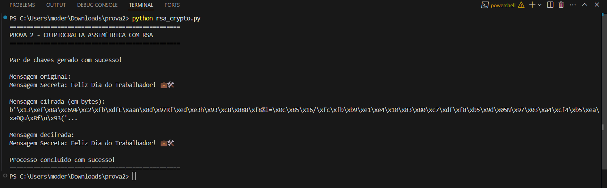

#🔐 Projeto de Criptografia Assimétrica com RSA em Python

Este projeto apresenta a implementação de um sistema de **criptografia assimétrica** utilizando o algoritmo **RSA (Rivest-Shamir-Adleman)**. O objetivo é permitir a **cifragem e decifragem de mensagens de texto** com segurança, utilizando um par de chaves (pública e privada).

---

## 📌 Objetivos da Prova

- Implementar criptografia assimétrica (RSA ou ECC)
- Criar funções para **cifrar e decifrar mensagens de texto**
- Utilizar **chaves pública e privada**
- Disponibilizar o código com documentação e imagens da execução real

---

## ⚙️ Execução do Projeto

### ✅ Requisitos

- Python 3.10 ou superior
- Biblioteca `cryptography`

### 📦 Instale com:

```bash
pip install cryptography
```

### ▶️ Execute com:

```bash
python rsa_crypto.py
```

---

## 🧠 Sobre o Algoritmo RSA

O **RSA (Rivest-Shamir-Adleman)** é um algoritmo de criptografia assimétrica que utiliza um **par de chaves**:

- 🔒 **Chave pública**: usada para **cifrar** mensagens  
- 🔓 **Chave privada**: usada para **decifrar** mensagens

Esse sistema garante que apenas o destinatário legítimo (com a chave privada) consiga ler as mensagens cifradas com sua chave pública. Neste projeto foi utilizado **padding OAEP com SHA256**, uma abordagem moderna e segura.

---

## 📸 Imagem da Execução no Terminal

Abaixo está a imagem do terminal comprovando a execução correta da prova:



---

## 📂 Estrutura Final do Projeto

```
criptografia-rsa/
├── rsa_crypto.py       # Código-fonte principal (cifragem e decifragem)
├── README.md           # Documento de explicação da prova
└── prints/
    └── execucao.png    # Captura da execução no terminal
```

---

## 🧾 Conclusão

O sistema desenvolvido cumpre os requisitos propostos na atividade de prova, demonstrando com clareza o funcionamento da **criptografia assimétrica RSA**. Com um código simples, funcional e bem documentado, o projeto oferece uma base sólida para aplicações que exijam segurança na troca de mensagens.
```
